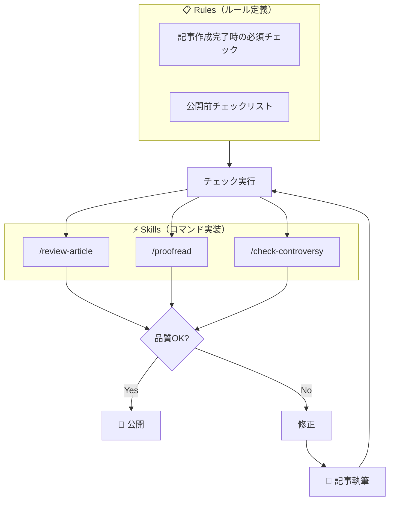

## TL;DR

- 技術ブログ執筆の「つらさ」（品質ばらつき・ミス見落とし・炎上リスク）を仕組み化で解決
- Skillsで品質レビュー・校正・炎上チェックをコマンド化
- Rulesで「チェックし忘れ」を防止し、毎回同じ品質を担保

## はじめに

この記事は、技術ブログ執筆のワークフローを改善したい方向けです。

私は以前から技術ブログを書いていましたが、記事を書くこと自体は楽しい一方で、品質を高めるためのチェック作業がいつも負担でした。構成は読みやすいか、表記ゆれはないか、炎上しそうな表現はないか...。気をつけるべき観点が多く、毎回確認するのは正直疲れます。

せっかく普段からClaude Codeを活用しているので、このチェック作業を仕組み化できないかと考えました。記事を書いて情報を届けるという本質的な部分に時間を使いたかったのです。

そこで、Claude CodeのRulesとSkillsを使って、執筆プロセスを仕組み化しました。この記事では、どんな課題があり、どう解決したかをお伝えします。

## 技術ブログ執筆の「つらさ」

技術ブログを書くとき、私は以下のような「つらさ」を感じていました。

### 1. 品質のばらつき

記事の品質は、執筆時のコンディションに左右されがちです。対象読者の明示、バージョン情報の記載、見出し構造の整理など、チェックすべき項目は多いですが、毎回完璧にこなすのは難しいものです。

### 2. 細かいミスの見落とし

誤字脱字、表記ゆれ（「GitHub」と「Github」の混在など）、冗長な表現...。自分で書いた文章は、自分ではミスに気づきにくいものです。

### 3. 炎上リスクへの不安

技術記事は、書き方次第で思わぬ炎上を招くことがあります。「すべてのエンジニアは〜すべき」といった断定表現、言語やフレームワークの優劣比較、上から目線の物言い...。書いているときは気づかなくても、公開後に指摘されて気づくことがあります。

公開ボタンを押す前に「これ、大丈夫かな...」と不安になる経験は、ブログを書いている方なら覚えがあるのではないでしょうか。

## 仕組み化のアプローチ

これらの課題に対して、Claude Codeの2つの機能を組み合わせて解決しました。

### Rules（ルール）

`.claude/rules/` ディレクトリにルールを書いておくと、Claude Codeがそのルールに従って動作します。CLAUDE.mdの拡張として、プロジェクト固有のルールを定義する仕組みです。詳細は[公式ドキュメント](https://code.claude.com/docs/ja/memory)を参照してください。

「記事を書いたらチェックを実行する」「公開前に炎上リスクを確認する」といったルールを定義することで、チェック漏れを防げます。

### Skills（スキル）

`.claude/skills/` ディレクトリにMarkdownファイルを置くと、`/ファイル名` でClaude Codeから呼び出せるコマンドになります。ルールで「何をチェックするか」を定義し、スキルで「どうチェックするか」を実装するイメージです。詳細は[公式ドキュメント](https://code.claude.com/docs/ja/skills)を参照してください。

```
/review-article      → 品質レビュー
/proofread           → 校正チェック
/check-controversy   → 炎上リスクチェック
```

### ワークフローの全体像



## 仕組み1: 品質の定量評価

品質レビュー（`/review-article`）では、6つの観点で記事を評価します。

| 観点             | 主なチェック内容                 |
| ---------------- | -------------------------------- |
| 読者視点         | 対象読者・前提知識・ゴールの明示 |
| 内容の正確性     | バージョン情報、再現可能性       |
| 引用・出典       | 外部情報の出典、リンク有効性     |
| 構成・読みやすさ | 見出し階層、段落の長さ           |
| SEO・発見性      | タイトル長、topics設定           |
| Zenn固有         | Front Matter、Zenn記法の活用     |

チェック結果は5段階評価（⭐1〜5）で出力されます。総合評価が⭐3以下の場合は改善を促します。

:::details 出力例

```markdown
# 記事レビュー結果

## 総合評価

⭐⭐⭐⭐☆ (4/5)

## 良い点

- 対象読者が冒頭で明示されている
- 具体的なコード例・設定ファイルがある
- Zenn記法（:::message等）が効果的に使われている

## 改善が必要な点

### 優先度: 高

- [ ] バージョン情報が未記載（Claude Code のバージョンを追記）

### 優先度: 中

- [ ] 行135: 段落が長い（200文字超）→ 分割を推奨

## 各観点の評価

| 観点       | 評価       | コメント                 |
| ---------- | ---------- | ------------------------ |
| 読者視点   | ⭐⭐⭐⭐⭐ | 対象者・メリットが明確   |
| 正確性     | ⭐⭐⭐⭐☆  | バージョン情報を追記推奨 |
| 引用・出典 | ⭐⭐⭐⭐⭐ | GitHubリンクあり         |
| 構成       | ⭐⭐⭐⭐☆  | 一部長い段落あり         |
| SEO        | ⭐⭐⭐⭐⭐ | タイトル・topicsが適切   |
| Zenn固有   | ⭐⭐⭐⭐⭐ | 記法を活用している       |
```

:::

## 仕組み2: 校正の自動化

校正チェック（`/proofread`）では、4つのカテゴリでミスを検出します。

| カテゴリ | 例                              |
| -------- | ------------------------------- |
| 誤字脱字 | 「以外と」→「意外と」           |
| 表記ゆれ | 「Github」と「GitHub」の混在    |
| 文法     | 「することができる」→「できる」 |
| 句読点   | 箇条書きの末尾句点の統一        |

技術用語の正式表記（GitHub、TypeScript、Node.js など）も定義しており、表記ゆれを自動検出します。

:::details 出力例

```markdown
# 校正チェック結果

## 検出件数サマリー

| カテゴリ | 件数 |
| -------- | ---- |
| 誤字脱字 | 1件  |
| 表記ゆれ | 2件  |
| 文法     | 1件  |
| 句読点   | 0件  |

## 修正が必要な箇所

### 誤字脱字

1. 行42: 「以外と」→「意外と」

### 表記ゆれ

1. 「Github」と「GitHub」が混在
   - 行18: Github → GitHub
2. 文体の混在
   - 行55: 「〜である」→「〜です」

### 文法

1. 行30: 「することができます」→「できます」（冗長）
```

:::

## 仕組み3: 炎上リスクの事前検知

炎上チェック（`/check-controversy`）では、5つのリスクパターンを定義しています。これらのパターンは、過去に炎上した技術記事や、炎上原因を分析したブログを参考にして設計しました。

| パターン                  | 概要                               |
| ------------------------- | ---------------------------------- |
| 機密情報漏洩              | 社内情報・個人情報の露出           |
| 上から目線                | 読者を見下すような表現             |
| マサカリ誘発表現          | 断定的な主張や言語比較             |
| 誤情報・未検証情報        | 動作未確認のコードや出典なしデータ |
| 顧客不在のHard Things自慢 | 苦労話が顧客視点を欠いている       |

各パターンに対して、具体的なNG表現とOK表現を定義しています。

```
NG: 「すべてのエンジニアはTypeScriptを使うべきだ」
OK: 「私のチームではTypeScriptを採用して良かったと感じています」
```

チェック結果は3段階（高・中・低リスク）で評価され、高リスクが検出された場合は修正するまで公開できない仕組みにしています。

:::details 出力例

```markdown
# 炎上チェック結果

## 総合リスク評価

🟡 中リスク

## 検出された問題

### 🔴 高リスク

- なし

### 🟡 中リスク

1. **上から目線表現**（行52）
   - 問題: 「〜を知らないのは勉強不足」
   - 修正案: 「意外と見落としがちな〜」

### 🟢 低リスク

1. **断定表現**（行38）
   - 問題: 「〜すべきです」
   - 修正案: 「〜がおすすめです」

## パターン別チェック結果

| パターン              | 結果      | 詳細 |
| --------------------- | --------- | ---- |
| 顧客不在のHard Things | ✅ OK     | -    |
| マサカリ誘発表現      | 🟢 軽微   | 1件  |
| 機密情報漏洩          | ✅ OK     | -    |
| 上から目線            | 🟡 要確認 | 1件  |
| 誤情報・未検証        | ✅ OK     | -    |
```

:::

:::details 参考：check-controversy.md の構造
スキルファイルでは、各パターンについて以下を定義しています：

- 背景・事例（なぜこのパターンが炎上しやすいか）
- チェック項目（具体的な確認ポイント）
- 危険な表現パターン（NG例とOK例）

詳細はリポジトリの `.claude/skills/check-controversy.md` を参照してください。

**参考にした記事:**

- [マサカリ避けテクニック](https://zenn.dev/terrierscript/articles/2018-04-25-masakari-yoke)
- [技術記事を書く人を大事にしよう](https://zenn.dev/kaityo256/articles/save_the_earth)
- [顧客不在のHard Thingsは炎上しやすい](https://note.com/zaizenyuta/n/n0fe3ae657266)
  :::

## 仕組み4: チェック漏れを防ぐ

ここが仕組み化の要です。Rulesでルールを定義することで、Claude Codeがそのルールに従って動作します。

`.claude/rules/article-creation-workflow.md` で以下を定義しています：

```markdown
記事を作成または大幅に編集した場合、作業を完了とする前に
以下のチェックを**Claude Code自身が実行**すること。

1. /review-article を実行
2. /proofread を実行
3. /check-controversy を実行（高リスクは修正必須）
```

このルールにより、「チェックを忘れて公開してしまった」という事故を防げます。ルールを読んだClaude Codeがチェックを実行してくれる仕組みです。

## 導入してみて

### ガードレールを敷くことの重要性

AIを活用する上で、ガードレールを敷くことは重要だと考えています。Claude Codeに記事執筆を手伝ってもらう以上、品質を担保する仕組みは必要です。

実際に運用を始めてみると、毎回同じ観点でチェックするのは人間には難しいことを実感しました。1記事あたり大小含めて10〜20件の指摘が挙がります。自分では気づかなかった表現や、うっかり見落としていたミスが見つかる。炎上リスクのチェックも、万が一のお守りとして安心感があります。

この仕組みを使って、[skillでClaude Codeのコンテキスト爆発を防ぐ](https://zenn.dev/sato_shogidemo/articles/claude-code-skill-context-management)や[Claude CodeでBacklogの生産性データを可視化してみた](https://zenn.dev/sato_shogidemo/articles/backlog-productivity-claude-code)といった記事も執筆しました。仕組み化のおかげで、記事を書くこと自体に集中できるようになったと感じています。

## まとめ

技術ブログ執筆の「つらさ」を、Claude CodeのRulesとSkillsで仕組み化しました。

- **Rules**: 記事作成完了時のチェックをルール化
- **Skills**: 品質レビュー、校正、炎上チェックをコマンド化

仕組み化の最大のメリットは「チェックし忘れ」を防げることです。人間の注意力に頼らず、プロセスで品質を担保できます。

本記事で紹介した仕組みはGitHubで公開していますので、気になった方は参考にしていただけると嬉しいです。

https://github.com/shogidemo/zenn-content
