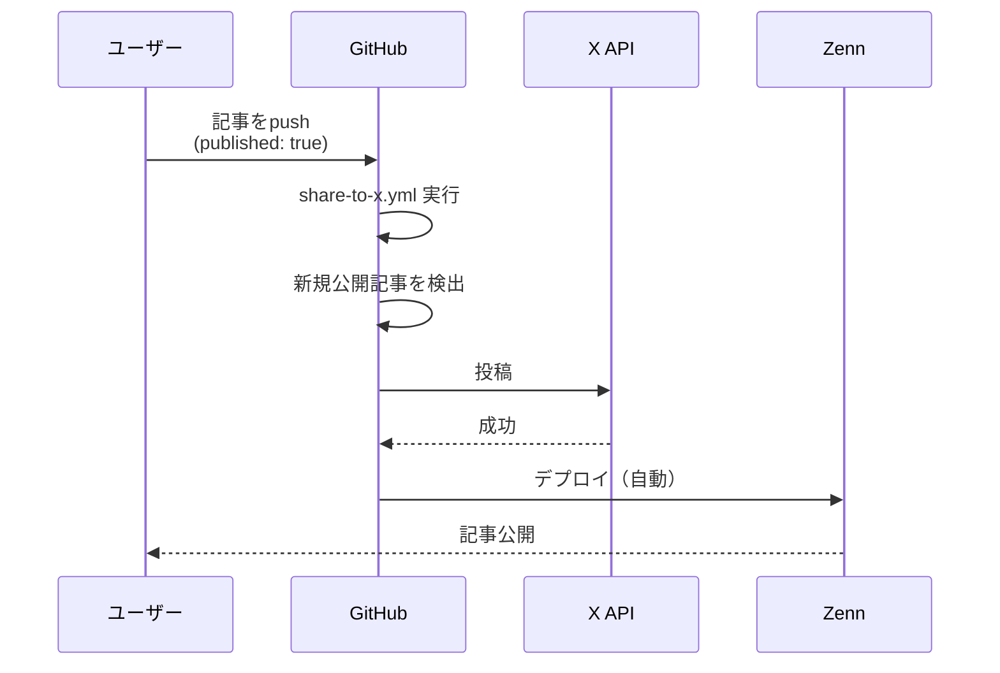
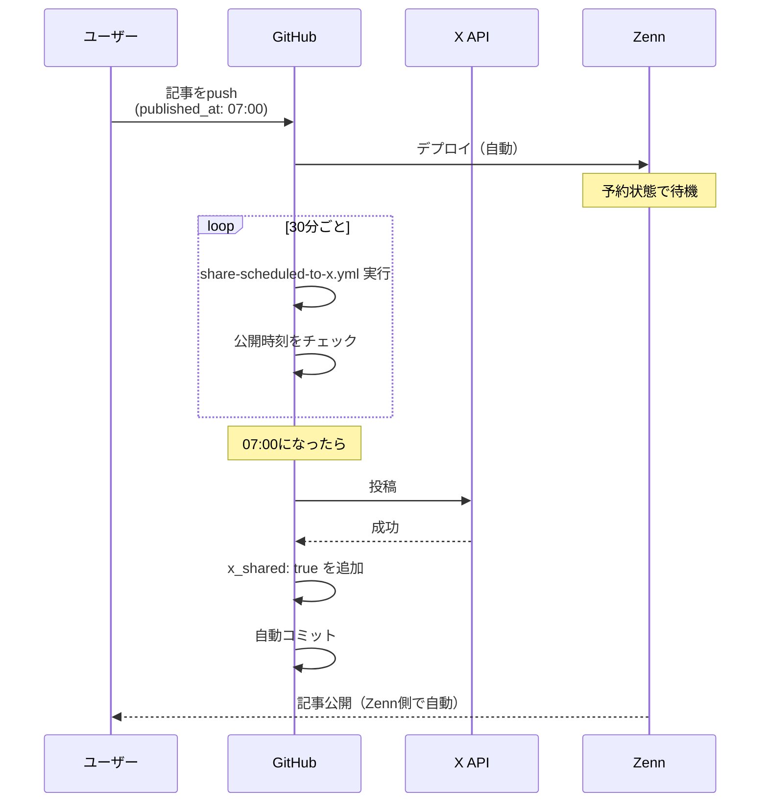

## TL;DR

- Zenn記事の公開に合わせてXに自動投稿するGitHub Actionsを作成
- **予約公開（`published_at`）にも対応**：公開時刻を過ぎたら自動でX投稿
- Node.js + twitter-api-v2でシンプルに実装

## はじめに

この記事は、Zenn記事のX自動投稿を**GitHub Actionsで実装したい方**向けです。

X自動投稿の実装方法については、すでに素晴らしい記事がいくつも公開されています。

https://zenn.dev/irongeneral21/articles/zenn-x-autotweet

https://zenn.dev/kannna5296/articles/2025-06-19-auto-x-post-action

https://zenn.dev/beachone1155/articles/20251001-x-automation

この記事では、**Zennの予約公開（`published_at`）に対応した実装**を紹介します。予約公開記事が公開時刻を迎えたタイミングで、自動的にXにも投稿されます。

:::message
**動作確認環境**

- Node.js: 20.x（`.nvmrc`で指定）
- twitter-api-v2: 1.x
- GitHub Actions: ubuntu-latest
  :::

## 前提: X API課金について

:::message alert
2026年1月時点、新規X Developerアカウントは**pay-per-use（従量課金）必須**です。最低$5のチャージが必要になります。

詳細は以下の記事が参考になります。
:::

https://zenn.dev/acntechjp/articles/4de3d142aaa05e

## 予約公開の前提条件

予約公開をX投稿と連携させるには、Front Matterで以下の両方を設定する必要があります：

- `published: true`（必須）
- `published_at: YYYY-MM-DD HH:MM`（JST形式で指定）

:::message
Zennの予約公開では `published: true` と `published_at` の両方が必要です。`published: false` のままだと、`published_at` の時刻になっても公開されません。
:::

## 実装の全体像

### 2種類のWorkflow

| Workflow                   | トリガー | 用途                         |
| -------------------------- | -------- | ---------------------------- |
| `share-to-x.yml`           | push時   | 即時公開記事をXに投稿        |
| `share-scheduled-to-x.yml` | 30分ごと | 予約公開記事を公開時刻に投稿 |

:::message
予約公開用Workflowは30分間隔で実行されるため、X投稿は公開時刻から**最大30分程度遅れる**ことがあります。より短い間隔にしたい場合はcronの設定を変更してください。
:::

### 処理フロー

#### 即時公開の場合



#### 予約公開の場合



### 投稿フォーマット

デフォルトでは以下の定型フォーマットで投稿されます：

```
{記事タイトル}

{記事URL}

{ハッシュタグ} #zenn
```

ハッシュタグは記事の`topics`から自動生成されます。

:::message
`topics`はインライン形式（`topics: ["a", "b"]`）のみ対応しています。YAML複数行リスト形式（`topics:\n  - a`）は対応していません。
:::

### カスタム投稿内容

Front Matterに`x_post`を追加すると、カスタム内容でX投稿できます：

```yaml
---
title: "記事タイトル"
x_post: |
  Zennの予約公開とX投稿を連携させるGitHub Actionsを作りました！
  予約時刻に自動でXにも投稿されます。

  {url}

  #zenn #githubactions
---
```

- `{url}` プレースホルダーは記事URLに自動置換される（現時点で利用可能なプレースホルダーは `{url}` のみ）
- `x_post`がなければ定型フォーマットにフォールバックする

## Workflow 1: 即時公開用

記事を`published: true`にしてpushしたタイミングでXに投稿します。

:::details share-to-x.yml（クリックで展開）

```yaml:.github/workflows/share-to-x.yml
name: Share to X

on:
  push:
    branches:
      - main
    paths:
      - "articles/*.md"

jobs:
  share:
    runs-on: ubuntu-latest
    steps:
      - uses: actions/checkout@v4
        with:
          fetch-depth: 2  # 前のコミットと比較するため

      - name: Setup Node.js
        uses: actions/setup-node@v4
        with:
          node-version-file: ".nvmrc"

      - name: Find newly published articles
        id: find-articles
        run: |
          CHANGED_FILES=$(git diff --name-only HEAD~1 HEAD -- 'articles/*.md' || echo "")

          if [ -z "$CHANGED_FILES" ]; then
            echo "articles=[]" >> $GITHUB_OUTPUT
            exit 0
          fi

          ARTICLES="["
          FIRST=true

          for file in $CHANGED_FILES; do
            if [ -f "$file" ]; then
              # published: true の記事
              PUBLISHED=$(grep -E "^published:\s*true" "$file" || echo "")
              if [ -n "$PUBLISHED" ]; then
                # published_at がある場合は予約公開なのでスキップ
                PUBLISHED_AT=$(grep -E "^published_at:" "$file" || echo "")
                if [ -n "$PUBLISHED_AT" ]; then
                  echo "Skipping $file (scheduled publishing)"
                  continue
                fi

                # 前のコミットで published: false だったか確認
                PREV_PUBLISHED=$(git show HEAD~1:"$file" 2>/dev/null | grep -E "^published:\s*true" || echo "")
                if [ -z "$PREV_PUBLISHED" ]; then
                  SLUG=$(basename "$file" .md)
                  TITLE=$(grep -E "^title:" "$file" | sed 's/title:\s*["'"'"']\(.*\)["'"'"']/\1/')
                  TOPICS=$(grep -E "^topics:" "$file" | sed 's/topics:\s*\[//' | sed 's/\]//' | tr -d '"' | tr -d "'" | tr ',' ' ')

                  if [ "$FIRST" = true ]; then
                    FIRST=false
                  else
                    ARTICLES="$ARTICLES,"
                  fi

                  ARTICLES="$ARTICLES{\"slug\":\"$SLUG\",\"title\":\"$TITLE\",\"topics\":\"$TOPICS\",\"file\":\"$file\"}"
                fi
              fi
            fi
          done

          ARTICLES="$ARTICLES]"
          echo "articles=$ARTICLES" >> $GITHUB_OUTPUT

      - name: Post to X
        if: steps.find-articles.outputs.articles != '[]'
        env:
          X_API_KEY: ${{ secrets.X_API_KEY }}
          X_API_KEY_SECRET: ${{ secrets.X_API_KEY_SECRET }}
          X_ACCESS_TOKEN: ${{ secrets.X_ACCESS_TOKEN }}
          X_ACCESS_TOKEN_SECRET: ${{ secrets.X_ACCESS_TOKEN_SECRET }}
          ZENN_USERNAME: ${{ secrets.ZENN_USERNAME }}
          ARTICLES: ${{ steps.find-articles.outputs.articles }}
        run: |
          npm install twitter-api-v2

          node << 'EOF'
          const { TwitterApi } = require('twitter-api-v2');
          const fs = require('fs');

          const client = new TwitterApi({
            appKey: process.env.X_API_KEY,
            appSecret: process.env.X_API_KEY_SECRET,
            accessToken: process.env.X_ACCESS_TOKEN,
            accessSecret: process.env.X_ACCESS_TOKEN_SECRET,
          });

          const articles = JSON.parse(process.env.ARTICLES);
          const username = process.env.ZENN_USERNAME;

          // Front Matterからx_postを取得
          function getXPost(filePath) {
            const content = fs.readFileSync(filePath, 'utf8');
            const match = content.match(/^---\n([\s\S]*?)\n---/);
            if (!match) return null;
            const frontMatter = match[1];
            const xPostMatch = frontMatter.match(/^x_post:\s*[|>]-?\s*\n((?:[ \t]+.+\n?)+)/m);
            if (xPostMatch) {
              return xPostMatch[1].split('\n').map(line => line.replace(/^[ \t]+/, '')).join('\n').trim();
            }
            const singleLineMatch = frontMatter.match(/^x_post:\s*["']?(.+?)["']?\s*$/m);
            return singleLineMatch ? singleLineMatch[1] : null;
          }

          async function postTweet(article) {
            const url = `https://zenn.dev/${username}/articles/${article.slug}`;
            const hashtags = article.topics.split(' ').filter(t => t).map(t => `#${t}`).join(' ');

            // x_postがあればそれを使用、なければ定型フォーマット
            const customPost = getXPost(article.file);
            const text = customPost
              ? customPost.replace(/\{url\}/g, url)
              : `${article.title}\n\n${url}\n\n${hashtags} #zenn`;

            try {
              await client.v2.tweet(text);
              console.log(`Posted: ${article.title}`);
            } catch (error) {
              console.error(`Failed to post: ${article.title}`);
              console.error(`Error: ${error.message}`);
              process.exit(1);
            }
          }

          (async () => {
            for (const article of articles) {
              await postTweet(article);
            }
          })();
          EOF
```

:::

### ポイント

- `fetch-depth: 2`で前のコミットと比較し、**新規公開を検出**
- `published_at`がある記事は予約公開用Workflowに任せるため**スキップ**

:::message
`git diff HEAD~1 HEAD`は直前のコミットとの比較です。複数コミットを一括pushする場合は、`github.event.before`と`github.sha`を使った範囲比較に変更することで、より確実に検出できます。
:::

## Workflow 2: 予約公開用

30分ごとに実行し、公開時刻を過ぎた記事を検出してXに投稿します。

:::details share-scheduled-to-x.yml（クリックで展開）

```yaml:.github/workflows/share-scheduled-to-x.yml
name: Share Scheduled Articles to X

on:
  schedule:
    - cron: "0,30 * * * *"  # 30分ごとにチェック
  workflow_dispatch:  # 手動実行も可能

jobs:
  share:
    runs-on: ubuntu-latest
    steps:
      - uses: actions/checkout@v4

      - name: Setup Node.js
        uses: actions/setup-node@v4
        with:
          node-version-file: ".nvmrc"

      - name: Find articles to share
        id: find-articles
        run: |
          NOW=$(date -u +%Y-%m-%dT%H:%M)
          echo "Current UTC time: $NOW"

          ARTICLES="["
          FIRST=true

          for file in articles/*.md; do
            if [ -f "$file" ]; then
              PUBLISHED=$(grep -E "^published:\s*true" "$file" || echo "")
              if [ -n "$PUBLISHED" ]; then
                PUBLISHED_AT=$(grep -E "^published_at:" "$file" | sed 's/published_at:\s*["'"'"']*\([0-9-]* [0-9:]*\)["'"'"']*/\1/' | xargs)

                if [ -n "$PUBLISHED_AT" ]; then
                  # JST -> UTC変換
                  PUBLISHED_AT_UTC=$(TZ=UTC date -d "$(echo $PUBLISHED_AT | sed 's/ /T/') +0900" +%Y-%m-%dT%H:%M 2>/dev/null || echo "")

                  # x_shared: true がなく、公開時刻を過ぎている場合
                  X_SHARED=$(grep -E "^x_shared:\s*true" "$file" || echo "")
                  if [ -z "$X_SHARED" ] && [ -n "$PUBLISHED_AT_UTC" ]; then
                    if [[ "$PUBLISHED_AT_UTC" < "$NOW" || "$PUBLISHED_AT_UTC" == "$NOW" ]]; then
                      SLUG=$(basename "$file" .md)
                      TITLE=$(grep -E "^title:" "$file" | sed 's/title:\s*["'"'"']\(.*\)["'"'"']/\1/')
                      TOPICS=$(grep -E "^topics:" "$file" | sed 's/topics:\s*\[//' | sed 's/\]//' | tr -d '"' | tr -d "'" | tr ',' ' ')

                      if [ "$FIRST" = true ]; then
                        FIRST=false
                      else
                        ARTICLES="$ARTICLES,"
                      fi

                      TITLE_ESCAPED=$(echo "$TITLE" | sed 's/"/\\"/g')
                      ARTICLES="$ARTICLES{\"slug\":\"$SLUG\",\"title\":\"$TITLE_ESCAPED\",\"topics\":\"$TOPICS\",\"file\":\"$file\"}"
                    fi
                  fi
                fi
              fi
            fi
          done

          ARTICLES="$ARTICLES]"
          echo "articles=$ARTICLES" >> $GITHUB_OUTPUT

      - name: Post to X and mark as shared
        if: steps.find-articles.outputs.articles != '[]'
        env:
          X_API_KEY: ${{ secrets.X_API_KEY }}
          X_API_KEY_SECRET: ${{ secrets.X_API_KEY_SECRET }}
          X_ACCESS_TOKEN: ${{ secrets.X_ACCESS_TOKEN }}
          X_ACCESS_TOKEN_SECRET: ${{ secrets.X_ACCESS_TOKEN_SECRET }}
          ZENN_USERNAME: ${{ secrets.ZENN_USERNAME }}
          ARTICLES: ${{ steps.find-articles.outputs.articles }}
        run: |
          npm install twitter-api-v2

          node << 'EOF'
          const { TwitterApi } = require('twitter-api-v2');
          const fs = require('fs');

          const client = new TwitterApi({
            appKey: process.env.X_API_KEY,
            appSecret: process.env.X_API_KEY_SECRET,
            accessToken: process.env.X_ACCESS_TOKEN,
            accessSecret: process.env.X_ACCESS_TOKEN_SECRET,
          });

          const articles = JSON.parse(process.env.ARTICLES);
          const username = process.env.ZENN_USERNAME;

          // Front Matterからx_postを取得
          function getXPost(filePath) {
            const content = fs.readFileSync(filePath, 'utf8');
            const match = content.match(/^---\n([\s\S]*?)\n---/);
            if (!match) return null;
            const frontMatter = match[1];
            const xPostMatch = frontMatter.match(/^x_post:\s*[|>]-?\s*\n((?:[ \t]+.+\n?)+)/m);
            if (xPostMatch) {
              return xPostMatch[1].split('\n').map(line => line.replace(/^[ \t]+/, '')).join('\n').trim();
            }
            const singleLineMatch = frontMatter.match(/^x_post:\s*["']?(.+?)["']?\s*$/m);
            return singleLineMatch ? singleLineMatch[1] : null;
          }

          async function postTweet(article) {
            const url = `https://zenn.dev/${username}/articles/${article.slug}`;
            const hashtags = article.topics.split(' ').filter(t => t).map(t => `#${t}`).join(' ');

            // x_postがあればそれを使用、なければ定型フォーマット
            const customPost = getXPost(article.file);
            const text = customPost
              ? customPost.replace(/\{url\}/g, url)
              : `${article.title}\n\n${url}\n\n${hashtags} #zenn`;

            try {
              await client.v2.tweet(text);
              console.log(`Posted: ${article.title}`);

              // x_shared: true をファイルに追加（重複投稿防止）
              let content = fs.readFileSync(article.file, 'utf8');
              content = content.replace(/^(published_at:.*)$/m, '$1\nx_shared: true');
              fs.writeFileSync(article.file, content);

              return true;
            } catch (error) {
              console.error(`Failed to post: ${article.title}`);
              console.error(`Error: ${error.message}`);
              return false;
            }
          }

          (async () => {
            let hasChanges = false;
            for (const article of articles) {
              if (await postTweet(article)) {
                hasChanges = true;
              }
            }
            process.exit(hasChanges ? 0 : 1);
          })();
          EOF

      - name: Commit changes
        if: steps.find-articles.outputs.articles != '[]'
        run: |
          git config user.name "github-actions[bot]"
          git config user.email "github-actions[bot]@users.noreply.github.com"
          git add articles/*.md
          git diff --staged --quiet || git commit -m "chore: mark articles as shared to X"
          git push
```

:::

### ポイント

- `published_at`をパースしてJST→UTC変換
- 投稿後に**`x_shared: true`をFront Matterに追加**して重複投稿を防止
- 変更を自動コミット＆プッシュ
- X投稿が失敗した記事には`x_shared`を追加しない（次回実行時に再試行される）
- 複数記事がある場合、一部が失敗しても成功した記事は処理される

:::message alert
このWorkflowはリポジトリへの書き込みが必要です。`git push`が失敗する場合は以下を確認してください：

- **権限不足**: Workflow内で`permissions: contents: write`を追加するか、リポジトリ設定でWorkflowの権限を変更
- **ブランチ保護**: mainブランチが保護されている場合、GitHub Actionsからのpushが拒否されることがある。保護ルールで「Allow GitHub Actions to create and approve pull requests」を有効にするか、PATを使用する
  :::

### Front Matterの例

```yaml
---
title: "記事タイトル"
published: true
published_at: 2026-01-22 07:00 # JSTで指定（YYYY-MM-DD HH:MM形式）
---
```

:::message
`published_at`は**JST（日本時間）で`YYYY-MM-DD HH:MM`形式**で記述してください（[Zenn CLIガイド](https://zenn.dev/zenn/articles/zenn-cli-guide)参照）。スクリプト内で`+0900`としてUTCに変換しています。
:::

投稿後は以下のようになります：

```yaml
---
title: "記事タイトル"
published: true
published_at: 2026-01-22 07:00
x_shared: true # 自動追加される
---
```

## セットアップ手順

### 1. X Developer Portalでアプリを作成

1. [X Developer Portal](https://developer.x.com/)にアクセス
2. アプリを作成
3. User authentication settingsで**Read and Write**権限を設定

:::message alert
**権限変更後はトークン再生成が必須**

権限を「Read and Write」に変更した後、必ずAccess TokenとAccess Token Secretを再生成してください。古いトークンはRead権限のままなので、投稿しようとすると`401 Unauthorized`エラーが発生します。
:::

### 2. GitHub Secretsの設定

リポジトリのSettings→Secrets and variables→Actionsに以下を登録：

| Secret名                | 内容                              |
| ----------------------- | --------------------------------- |
| `X_API_KEY`             | API Key（Consumer Key）           |
| `X_API_KEY_SECRET`      | API Key Secret（Consumer Secret） |
| `X_ACCESS_TOKEN`        | Access Token                      |
| `X_ACCESS_TOKEN_SECRET` | Access Token Secret               |
| `ZENN_USERNAME`         | Zennのユーザー名                  |

### 3. Workflowファイルを配置

上記の2つのWorkflowファイルを`.github/workflows/`に配置してpushすれば完了です。

## まとめ

- **即時公開**：`published: true`にしてpush → 自動でXに投稿
- **予約公開**：`published_at`を設定 → 公開時刻に自動でXに投稿
- 重複投稿は`x_shared: true`で防止

実装はシンプルですが、Zennの予約公開と連携できるので便利に使っています。

同じような仕組みを作りたい方の参考になれば幸いです。より良い方法があればコメントで教えてください。
