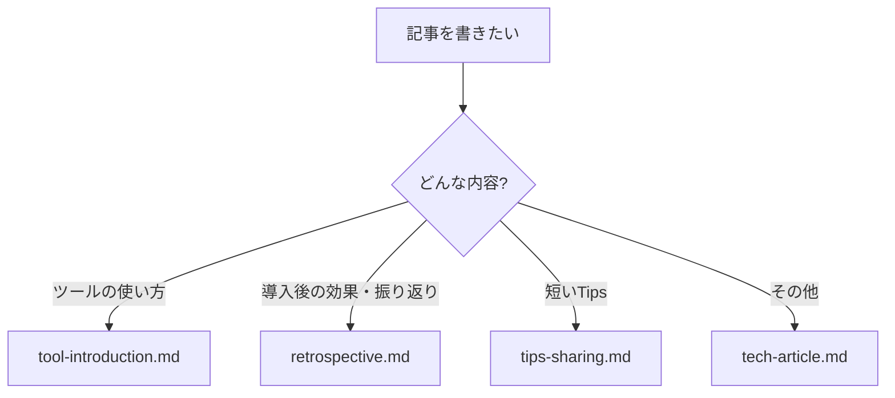

# 記事テンプレート

## テンプレート一覧

| テンプレート | ファイル               | 用途                    |
| ------------ | ---------------------- | ----------------------- |
| 技術記事     | `tech-article.md`      | 課題解決・実装手順      |
| ツール紹介   | `tool-introduction.md` | 新しいツールの導入      |
| 振り返り     | `retrospective.md`     | 効果測定・N週間/Nヶ月後 |
| Tips共有     | `tips-sharing.md`      | 短いTips・小ネタ        |

## 選び方



## 使い方

### 方法1: 直接コピー

```bash
cp templates/tech-article.md articles/my-article.md
```

### 方法2: Zenn CLIと併用

```bash
# 1. Zenn CLIで記事作成
npx zenn-cli new:article --slug my-article

# 2. 生成されたファイルをテンプレートで上書き
cp templates/tech-article.md articles/my-article.md
```

## 執筆ガイド

テンプレートはミニマルに設計しています。詳細な執筆ガイドは以下を参照してください：

- [品質ガイドライン](../.claude/rules/zenn-quality-guidelines.md) - Zennらしい記事の書き方
- [公開前チェックリスト](../.claude/rules/pre-publish-checklist.md) - 公開前の確認事項
- [トピック選定](../.claude/rules/topic-guidelines.md) - 何を書くべきか
